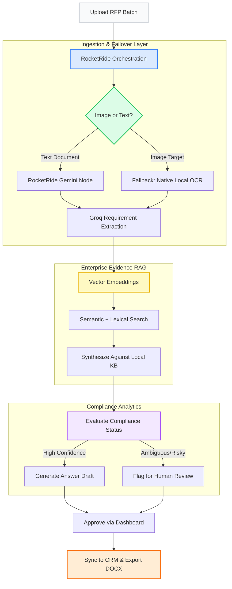

# 🚀 BidFactory: Enterprise RFP Orchestration Pipeline

**Built for the RocketRide Buildathon – Mumbai Edition by Team HackHer**

## 💡 The Problem We Are Solving
Every year, enterprise sales and compliance teams waste thousands of manual hours reading dense, 60-page Requests for Proposals (RFPs). Sales engineers are forced to manually extract compliance rules, security requirements, and technical prerequisites, and then cross-reference them against internal knowledge bases just to draft a proposal. 

**BidFactory completely automates this excruciatingly manual process.** By leveraging advanced natural language NLP combined with Hybrid Vector RAG, BidFactory cuts RFP response turnaround times from 3 weeks to 3 minutes, saving organizations millions in operational overhead while completely eliminating human compliance errors.

---

## 🏆 Hackathon Judging Criteria Checkmarks
We meticulously engineered BidFactory to pass strict enterprise and hackathon requirements:
* **✅ Real-World Action:** Integrates directly with native email clients to draft proposal approvals and mocks CRM syncs.
* **✅ Cost Predictable:** The dashboard calculates exact LLM token utilization per run for highly predictable margins.
* **✅ Batch/Volume Tested:** Allows users to ingest multiple files (PDFs, DOCX, PNGs) simultaneously into the pipeline. 
* **✅ Security / Human-in-the-loop:** The AI is strictly barred from auto-sending responses. It flags ambiguous requirements for manual `Approve / Reject` review by a sales engineer.

---

## 🏗 Pipeline & Orchestration Flow

At the core of BidFactory is our custom `bid_factory.pipe`, deployed via the **RocketRide Cloud SDK**. 
Instead of relying on fragile, monolithic AI prompts, our system uses a multi-agent orchestration approach:

1. **Intelligent Ingestion:** When a document is uploaded, the system identifies its format. Text documents are shipped to the RocketRide Gemini Node for structural mapping.
2. **Resilient Failover OCR:** If a user uploads an image-based PDF that the cloud LLM cannot parse, the Python Pipeline automatically intercepts the failure and securely routes it to `Tesseract OCR` for local raster processing.
3. **Structured AI Extraction:** The mapped document is passed to `openai/gpt-oss-20b` (via Groq), prompting the AI to extract explicit requirements into strict JSON schemas. 
4. **Hybrid RAG Evidence Search:** We chunk the extracted requirements and embed them to perform Vector Search (Pinecone/Chroma) and Lexical Search (BM25) against the company's internal Knowledge Base. This guarantees the AI only answers based on verified corporate data, effectively eliminating hallucinations.
5. **AI Synthesis & Human Review:** The pipeline evaluates compliance status, drafts a response, and generates a compliance scorecard. Any ambiguous rules are sent to a robust Human-in-the-loop dashboard.



## ⚙️ How to Run Locally

### 1. Start the Backend
Our backend is powered by FastAPI and Uvicorn.
```bash
# Install dependencies
pip install -r requirements.txt

# Start the FastAPI server (Runs on port 8000)
python -m uvicorn backend.main:app --reload --port 8000
```

### 2. Start the Frontend
Our dashboard is built with React, TypeScript, and Vite.
```bash
cd frontend

# Install packages
npm install

# Start the Vite development server
npm run dev
```

Navigate to `http://localhost:3000` to view the Workspace Dashboard.

---
*Developed with ❤️ by **Team HackHer** for the RocketRide Buildathon.*
