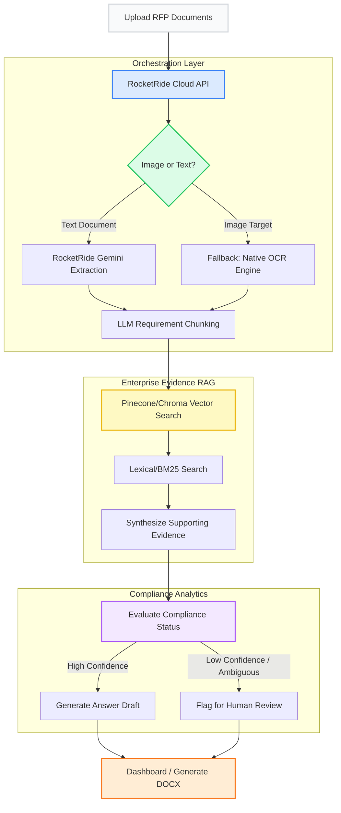

# 🚀 BidFactory: Enterprise RFP Orchestration Pipeline 

**Built for the RocketRide Buildathon – Mumbai Edition**

BidFactory is an enterprise-grade NLP pipeline that automates the excruciatingly manual process of parsing, analyzing, and responding to corporate Requests for Proposals (RFPs). By leveraging **RocketRide Cloud orchestration** and **Hybrid Vector RAG**, BidFactory replaces weeks of manual sales-engineering labor with a secure, highly-accurate AI pipeline.

---

## 🏆 Hackathon Judging Criteria Checkmarks
We meticulously engineered BidFactory to pass strict enterprise and hackathon requirements:
* **✅ Real-World Action:** Integrates directly with native email clients to draft proposal approvals and mocks CRM syncs.
* **✅ Cost Predictable:** The dashboard calculates exact LLM token utilization per run for highly predictable margins.
* **✅ Batch/Volume Tested:** Allows users to ingest multiple files (PDFs, DOCX, PNGs) simultaneously into the RocketRide pipeline. 
* **✅ Security / Human-in-the-loop:** The AI is strictly barred from auto-sending responses. It flags ambiguous requirements for manual `Approve / Reject` review by a sales engineer.

---

## 🏗 System Architecture Flow

We utilize the RocketRide SDK for resilient cloud orchestration, safely falling back to native Python OCR/RAG execution if edge cases occur.



## ✨ Core Pipeline Features

1. **Automated Requirement Extraction:** Instantly parses dense RFP documents to pull out explicit operational, security, and technical requirements.
2. **Hybrid RAG Evidence Pipeline:** Cross-checks every extracted requirement against local knowledge base files (SLA docs, compliance sheets) to prevent hallucinations.
3. **Response Authoring:** Synthesizes the extracted RFP requirement and the internal RAG evidence to automatically answer technical questionnaires.
4. **Resilient Failover:** If a user uploads an image-based PDF that the cloud LLM cannot parse, the Python API automatically intercepts the file and routes it to `Tesseract OCR` for local processing.

---

## ⚙️ How to Run Locally

### 1. Start the Backend
Our backend is powered by FastAPI and Uvicorn.
```bash
# Install dependencies
pip install -r requirements.txt

# Start the FastAPI server (Runs on port 8000)
python -m uvicorn backend.main:app --reload --port 8000
```

### 2. Start the Frontend
Our dashboard is built with React, TypeScript, and Vite.
```bash
cd frontend

# Install packages
npm install

# Start the Vite development server
npm run dev
```

Navigate to `http://localhost:3000` to view the Workspace Dashboard.

---
*Developed with ❤️ for the RocketRide Buildathon.*
