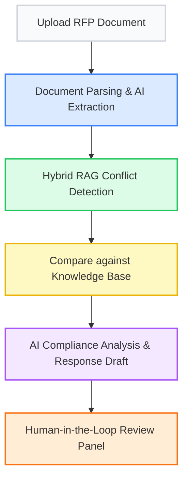

# 🚀 Bid-Factory: AI-Powered RFP Response & Compliance 

**Built for the RocketRide Buildathon – Mumbai Edition**

Bid-Factory is an enterprise-grade AI solution that automates the painfully manual process of responding to Requests for Proposals (RFPs) and verifying internal compliance. By leveraging the **RocketRide Cloud**, it cuts down RFP turnaround times from weeks to hours without compromising accuracy.

## ✨ Key Features
- **Automated Requirement Extraction:** Instantly parses dense RFP documents to pull out explicit operational, security, and technical requirements.
- **Hybrid RAG Compliance Verification:** Cross-checks every extracted requirement against your company's internal knowledge base (SLA docs, security policies) using both semantic and lexical search.
- **AI-Driven Response Generation:** Automatically drafts proposed answers and attaches the exact evidence used to generate it.
- **Human-in-the-Loop Review:** Enterprise compliance requires trust. Our dedicated review dashboard lets sales engineers inspect the AI's source evidence and Approve, Edit, or Reject outputs.

## 🏗 Pipeline Architecture 

Below is the automated AI pipeline flow orchestrated via `bid_factory.pipe` on the RocketRide cloud:



## 🛠 Tech Stack
- **Backend:** Python, FastAPI, Uvicorn
- **Frontend:** React, TypeScript, Vite
- **AI / Pipeline:** RocketRide Cloud SDK, RocketRide Gemini Node
- **Retrieval:** Hybrid Search (Semantic + Lexical)

## ⚙️ How to Run Locally

### 1. Start the Backend
```bash
# Install dependencies
pip install -r requirements.txt

# Start the FastAPI server
python -m uvicorn backend.main:app --reload --port 8000
```

### 2. Start the Frontend
```bash
cd frontend

# Install packages
npm install

# Start the Vite development server
npm run dev
```

### 3. Start RocketRide Integration
```bash
# Ensure your RocketRide connection/CLI is active
npx rocketride login
```

Navigate to `http://localhost:3000` to view the Workspace Dashboard.

---
*Created by Team for the RocketRide Buildathon.*
